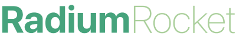

 
# Become a Software Professional 2023
This is my repository for the bootcamp of Radium Rocket: Become a Software Professional 2023 edition.
In the next weeks we will be working on a project named "Mega Rocket's Gym".
The idea of this project is to create a functional webpage for a gym in which both members and trainers feel comfortable using it.

## Week 01
Me and my team been working on Figma designing the web page, creating the canvas and connecting them. Me specifically, I've been working on the member profile, giving them options to edit their profile and change memberships.

## Week 02
In this week I'll be working on the HTML structure of the landpage with the design previously created.

## Week 03
This time I'll be working on the styles of the structure created last week using a reset.css and styles.css file trying to make a pixel perfect page.

## Week 04
This task consists of recreating the landing page styles again but with a responsive model taking priority on the mobile model (mobile first).
We will also be working on a new github feature called github pages, wich allows you to view the repository online, without having to download the content.
The Github pages for this week can be found on: https://dannylez.github.io/BaSP-M2023/Week-04/index.html" .

## Week 05
On this week I had to perform javascript exercises showing the results in the console and in alerts.
The exercises contained concepts such as:
<ol>
    <li>Variables and operators.</li>
    <li>Strings.</li>
    <li>Arrays.</li>
    <li>If else.</li>
    <li>For loops.</li>
    <li>Functions.</li>
</ol>
The Github pages for this week can be found on: https://dannylez.github.io/BaSP-M2023/Week-05/index.html .